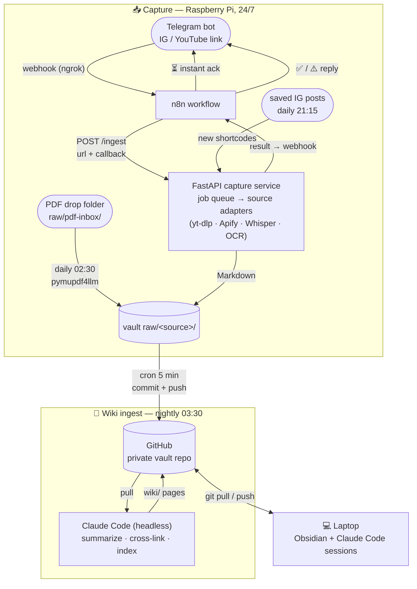

# Content → Markdown Capture (Second-Brain Ingest)

[](https://www.python.org/downloads/)
[](https://fastapi.tiangolo.com)
[](https://www.docker.com/)
[](https://opensource.org/licenses/MIT)

Turn an **Instagram reel/post or YouTube video** into a clean, **LLM-optimized Markdown
file** and drop it into your local knowledge vault (Obsidian, an LLM wiki, plain folder —
anything file-based).

It is built around **pluggable source adapters**: one endpoint takes any supported URL,
dispatches to the right adapter, and extracts the content *faithfully* — summarizing,
tagging and cross-linking stay with your downstream tool (e.g. an LLM that reads your
vault). Send a link, get a source document, grouped per creator. Adding a platform means
adding **one file** under `sources/`.

> Send a Telegram message with a link → a Markdown file appears in
> `raw/<source>/<handle>/`, ready for your "second brain".

## What it captures

One Markdown file per URL, with light YAML frontmatter and up to three content layers:

| Source | Content | How |
|--------|---------|-----|
| **Instagram reel/video** | caption + metadata, spoken transcript, on-screen text | yt-dlp → Whisper (`faster-whisper` local or OpenAI API) + ffmpeg scene-change keyframes → RapidOCR |
| **Instagram image post / carousel** | caption + metadata, on-screen text of every slide | Apify fallback (yt-dlp can't fetch image posts) → RapidOCR |
| **YouTube video** | description + chapters + metadata, transcript | yt-dlp; prefers existing subtitles (manual > auto), falls back to Whisper; OCR optional |

Failures (login-walled, restricted, rate-limited, transient) come back as structured,
user-friendly messages — ready to display in a bot reply. Media is processed and then
deleted; only the Markdown is kept.

### Example output

```markdown
---
title: "The 5 skills that will run the future"
type: source
source: instagram
url: https://www.instagram.com/reels/XXXX/
author: "Callum Carver"
handle: callumcarver
published: 2026-06-20
captured: 2026-06-21
likes: 269
language: en
tags: [instagram, reel, inbox]
---

# The 5 skills that will run the future

## Caption
...
## On-screen text
5 AI skills that will pay you $20,000/month
## Transcript
...
```

## Architecture

```
(optional) Telegram bot ──► n8n (via ngrok) ──► POST /ingest {url}
                                                       │
                       ┌──────────── FastAPI (Docker) ─────────────┐
                       │ registry: URL ──► source adapter           │
                       │   instagram: yt-dlp ▸ Apify fallback       │
                       │   youtube:   subtitles ▸ Whisper fallback  │
                       │ shared: Whisper · frames+OCR · errors      │
                       │ render Capture → Markdown                  │
                       │ write → <vault>/raw/<source>/<handle>/     │
                       └────────────────────────────────────────────┘
```

The core is a single FastAPI service. The Telegram + n8n layer is **optional** — you can call
the HTTP endpoint directly from a script, a cron job, or any automation tool.

### Repository layout

```
scripts/
  main.py                  FastAPI app (+ /health)
  config.py                env-driven settings
  errors.py                error classification → user-friendly messages
  api/routes.py            POST /ingest (+ /n8n/ingest alias) — URL dispatch
  sources/
    base.py                Source interface + normalized Capture model
    registry.py            URL → adapter resolution (register new sources here)
    instagram.py           yt-dlp + Apify fallback (image posts, login walls)
    youtube.py             subtitles-first, Whisper fallback, chapters
  helpers/
    transcribe.py          faster-whisper / OpenAI whisper
    frames.py              ffmpeg scene-change keyframes
    ocr.py                 RapidOCR on-screen text
    markdown.py            render + write the raw/ document
  tools/                   host-side companion scripts (cron)
    convert_pdfs.py        PDF drop-folder -> Markdown (pymupdf4llm)
    saved_posts_capture.py saved IG posts -> /ingest (Instaloader session)
Dockerfile / docker-compose.yml   (includes optional ngrok service)
requirements.txt
.env.example
n8n_telegram_capture.json  importable n8n workflow (Telegram trigger)
```

## The full pipeline (example deployment)

How everything composes into a hands-off "second brain" feed — as deployed 24/7 on a
Raspberry Pi 5, with the knowledge vault synced through a private Git repo and an LLM
(Claude Code, headless) doing the nightly wiki work:



| Workflow | Trigger | What happens |
|---|---|---|
| **Link capture** | Telegram message, anytime | ack in seconds → queued job → caption/transcript/OCR → `raw/` → ✅ reply via callback webhook |
| **Saved-posts capture** | daily 21:15 | Instaloader lists your saved IG posts (login only for listing); new ones go through `/ingest`; Telegram summary |
| **PDF capture** | daily 02:30 | PDFs dropped into `raw/pdf-inbox/` become frontmattered Markdown in `raw/pdf/` (original kept) |
| **Vault sync** | every 5 min | new `raw/` files committed + pushed to the private vault repo |
| **Wiki ingest** | daily 03:30 | headless Claude Code summarizes new sources into `wiki/`, cross-links, updates index + log |
| **Working on it** | whenever | laptop pulls the vault, you browse in Obsidian / query via Claude Code, pushes flow back |

Each piece is optional — the capture service works standalone via plain HTTP.

## Initial setup

**Prerequisites:** Docker + Docker Compose. (ffmpeg, yt-dlp, Whisper and RapidOCR all run
inside the container — nothing else to install.)

1. Clone and configure:
   ```bash
   git clone <your-fork-url>
   cd instagram-markdown-capture
   cp .env.example .env
   ```
2. Edit `.env` — set `VAULT_HOST_PATH` to the absolute path of your vault's `raw/` folder.
   Pick `WHISPER_MODEL` (`base` is a good default; `small`/`medium` are more accurate).
3. Build and run:
   ```bash
   docker compose up --build -d
   ```
   The first ingest downloads the Whisper + OCR models once (cached afterwards).
4. Test it:
   ```bash
   curl -X POST http://localhost:8000/n8n/ingest \
     -H "Content-Type: application/json" \
     -d '{"url":"https://www.instagram.com/reels/XXXX/"}'
   ```
   A `.md` file should appear in `<your-vault>/raw/instagram/<handle>/`.

### Optional: Telegram trigger via n8n

Capture links from your phone by sending them to a Telegram bot.

1. Create a bot with [@BotFather](https://t.me/botfather) and copy the token.
2. Expose your n8n to the internet so Telegram can reach it. The compose file ships an
   optional **ngrok service** (set `NGROK_AUTHTOKEN` + `NGROK_DOMAIN` in `.env`); set n8n's
   `WEBHOOK_URL` to that public URL. Running ngrok in-container also dodges host antivirus
   TLS interception.
3. In n8n, import `n8n_telegram_capture.json`, assign your Telegram credential to the
   Telegram nodes, and activate the workflow.
4. Send a link to your bot. The workflow:
   `Telegram trigger → instant source-aware "processing…" reply → POST /ingest → "✅ saved" / friendly error reply`.

> If n8n runs in Docker, it reaches the API container at `http://host.docker.internal:8000`.

## Configuration

| Variable | Default | Description |
|----------|---------|-------------|
| `VAULT_HOST_PATH` | – | Host path to your vault's `raw/` folder (bind-mounted into the container) |
| `INSTAGRAM_SUBDIR` | `instagram` | Subfolder inside `raw/`; files are written to `<sub>/<handle>/` |
| `WHISPER_MODE` | `LOCAL` | `LOCAL` (faster-whisper) or `API` (OpenAI) |
| `WHISPER_MODEL` | `base` | `tiny`/`base`/`small`/`medium`/`large-v3` |
| `WHISPER_COMPUTE_TYPE` | `int8` | CTranslate2 compute type (`int8`, `float32`, …) |
| `WHISPER_API_KEY` | – | OpenAI key, only when `WHISPER_MODE=API` |
| `APIFY_API_TOKEN` | – | Enables the Instagram image-post/carousel fallback (reels work without it) |
| `YOUTUBE_OCR` | `false` | Also OCR video frames for YouTube (slow on long videos) |
| `MAX_CONCURRENT_INGESTS` | `2` | Parallel ingest limit (protects CPU on small hosts) |
| `NGROK_AUTHTOKEN` / `NGROK_DOMAIN` | – | Only for the optional ngrok compose service |

## API

| Endpoint | Method | Body | Description |
|----------|--------|------|-------------|
| `/ingest` (alias: `/n8n/ingest`) | POST | `{"url": "<instagram-or-youtube-url>"}` | Capture one URL → write Markdown, return a summary |
| `/health` | GET | – | Liveness check |

Responses are always HTTP 200 with a JSON body: on success `{success, file, source,
kind, author, language, transcript_chars, caption_chars, ocr_blocks}`; on failure
`{success: false, error_code, user_message, detail}` — `user_message` is safe to show
directly to end users (e.g. as a bot reply).

## Roadmap

- [ ] Strip tracking params (`?igsh=…`) from captured URLs
- [ ] Account monitoring: scheduled batch capture of a creator's latest reels
- [ ] More sources: TikTok, podcasts/RSS, web articles (one adapter file each)
- [x] ARM/Raspberry Pi support (runs on a Pi 5 with `WHISPER_MODEL=tiny`)
- [ ] Better OCR cleanup (drop UI chrome, merge fragmented text)

## Contributing

Contributions are very welcome — this is an early, focused tool and there is plenty of low-
hanging fruit (see the roadmap). To get involved:

1. Fork the repo and create a feature branch.
2. Keep changes small and focused; match the existing style.
3. Open a pull request describing the change and how you tested it.

Bug reports, ideas and "it didn't work for this reel" issues are equally useful — please open
an issue with the URL (if shareable) and the error.

## Notes & limits

- Works with **public** reels/posts. Private or age-gated content may require yt-dlp cookies.
- Respect Instagram's Terms of Service and creators' rights; use for personal knowledge capture.

## Credits

Repurposed from an earlier Instagram automation project; the pipeline has been rebuilt around
local, file-based knowledge capture. Licensed under the **MIT License** — see `LICENSE`.
